<div align="center">


[](https://github.com/DarvinInfantMichael)
[](https://github.com/DarvinInfantMichael)

</div>

---

## 🚀 About Me

<div align="center">

<table>
<tr>
<td width="50%" valign="top">

### 👨‍💻 Quick Facts

```yaml
name: Darvin Infant Michael
located_in: Chennai, India
current_role: Full Stack Developer
education: Computer Science
company: Building Amazing Things

fields_of_interests:
  - AI & Machine Learning
  - Web Development
  - Cloud Architecture
  - Open Source
  - DevOps
```

</td>
<td width="50%" valign="top">

### 💼 What I Do

```typescript
class Developer {
  constructor() {
    this.name = "Darvin";
    this.dayStartsWith = "☕ Coffee";
    this.nightEndsWith = "💻 Code";
  }

  worksWith() {
    return [
      "React & Next.js",
      "Node.js & Python", 
      "AWS & Docker",
      "MongoDB & PostgreSQL"
    ];
  }

  currentlyLearning() {
    return [
      "System Design 🏗️",
      "Kubernetes ☸️",
      "AI/ML 🤖"
    ];
  }
}
```

</td>
</tr>
</table>

</div>

<div align="center">

### 🎯 My Coding Journey

```mermaid
graph LR
    A[💡 Idea] --> B[🎨 Design]
    B --> C[💻 Code]
    C --> D[🧪 Test]
    D --> E[🚀 Deploy]
    E --> F[📊 Monitor]
    F --> A
    
    style A fill:#2E9EFF
    style B fill:#667EEA
    style C fill:#2E9EFF
    style D fill:#667EEA
    style E fill:#2E9EFF
    style F fill:#667EEA
```

[](https://roadmap.sh)

</div>

<div align="center">



**My Development Workflow** ⚡

</div>

---

## 🛠️ Tech Stack

<div align="center">

### Frontend


### Backend


### Database & Cloud


</div>

---

## 📊 GitHub Analytics

<div align="center">
  


</div>

<div align="center">

[](https://git.io/streak-stats)

</div>

<div align="center">

### 🏆 GitHub Trophies
[](https://github.com/ryo-ma/github-profile-trophy)

</div>

---

## 📈 Contribution Graph

<div align="center">

[](https://github.com/ashutosh00710/github-readme-activity-graph)

</div>

---

## 🎯 Current Focus

<table align="center">
<tr>
<td align="center" width="50%">

### 💻 Building
- AI-Powered Web Apps
- Real-time Collaboration Tools
- Cloud-Native Solutions
- Open Source Libraries

</td>
<td align="center" width="50%">

### 📚 Learning
- Advanced System Design
- Microservices Architecture
- Kubernetes & DevOps
- Machine Learning

</td>
</tr>
</table>

---

## 🌐 Connect With Me

<div align="center">

[](https://linkedin.com/in/darvin-infant-michael)
[](https://twitter.com/darvinmichael)
[](mailto:darvininfantmichael@gmail.com)
[](https://dev.to/darvinmichael)
[](https://discord.com/users/darvin#1234)

</div>

---

<div align="center">

### 💡 Open to Collaborations & Interesting Projects!

[](https://github.com/piyushsuthar/github-readme-quotes)

</div>

---

<div align="center">

### ⭐ If you find my work interesting, don't forget to star my repositories!


</div>
